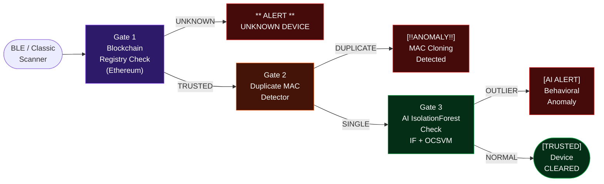
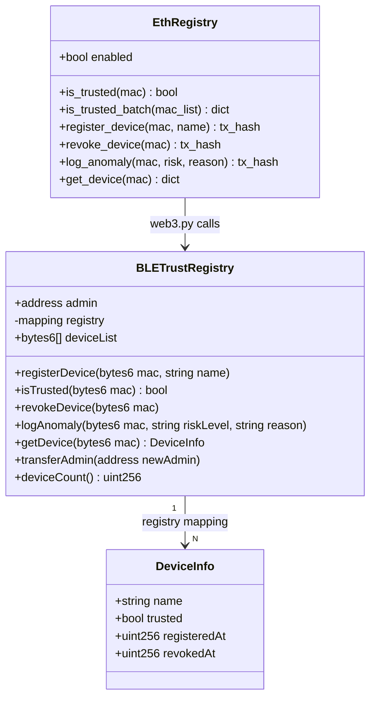
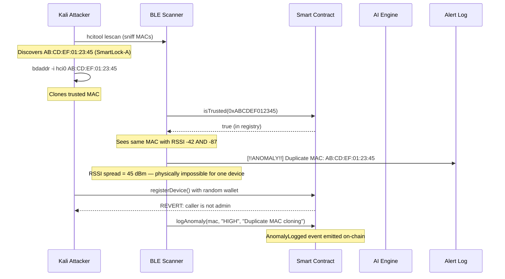
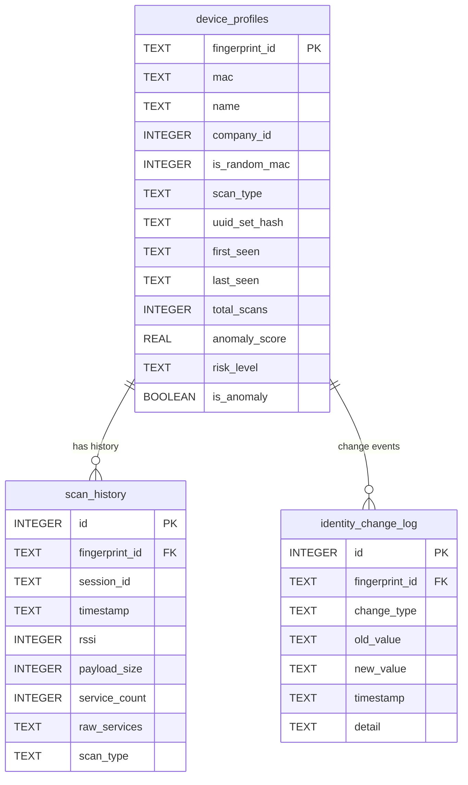

# BLE Device Trust Registry

> **A Blockchain-Based Approach to Bluetooth Classic and Low Energy Security**

**Authors:** [@manasvi-0523](https://github.com/manasvi-0523) &middot; [@mithun50](https://github.com/mithun50)

A decentralized system that anchors Bluetooth device identities to an Ethereum smart contract on the Sepolia testnet, providing immutable audit trails and real-time rogue device detection. Combines three independent security layers: on-chain trust registry, duplicate MAC detection, and AI behavioral anomaly detection.

**Index Terms:** BLE Security, Blockchain, Ethereum, Smart Contracts, IoT Security, Isolation Forest, MAC Spoofing Detection

---

## System Architecture

```mermaid
graph TB
    subgraph Scan["Phase 1 — Bluetooth Scan"]
        A[BLE Advertising Devices] -->|bleak async| B[BLE Scanner]
        C[Classic BT Devices] -->|PowerShell PnP| D[Classic BT Scanner]
        B --> E[Device List\nMAC + RSSI + Services]
        D --> E
    end

    subgraph Gate1["Gate 1 — Blockchain Registry Check"]
        E -->|eth_is_trusted_batch\nParallel RPC| F{On-Chain\nisTrusted?}
        F -->|No| G["** ALERT: UNKNOWN DEVICE **"]
        F -->|Yes| H[Pass]
    end

    subgraph Gate2["Gate 2 — Duplicate MAC Detector"]
        H --> I{Same MAC\n2x RSSI?}
        I -->|Yes| J["[!!ANOMALY!!] Duplicate MAC\nPossible MAC Cloning"]
        I -->|No| K[Pass]
    end

    subgraph Gate3["Gate 3 — AI Behavioral Check"]
        K --> L[(SQLite Registry\nBehavioral History)]
        L -->|12 features| M[IsolationForest\n+ One-Class SVM]
        M -->|Both flag -1| N["[AI ALERT] Behavioral Outlier"]
        M -->|Normal| O["[TRUSTED] Device CLEARED"]
    end

    subgraph Audit["Audit Layer"]
        G & J & N --> P[alerts.csv]
        O --> Q[Local SHA-256 Blockchain]
        N -->|logAnomaly| R[Ethereum Event Log\nSepolia Etherscan]
    end

    style Gate1 fill:#1a0a2e,stroke:#7c3aed
    style Gate2 fill:#2e1a0a,stroke:#ea580c
    style Gate3 fill:#0a1a0a,stroke:#16a34a
    style Audit fill:#0a0a1e,stroke:#3b82f6
```



---

## Defense-in-Depth Pipeline (Paper Figure 5)



---

## Smart Contract Architecture



---

## Attack Detection Sequence (MAC Spoofing)



---

## Database Schema



---

## Behavioral Feature Vector

```mermaid
graph LR
    subgraph History["SQLite scan_history window (last 30 scans)"]
        R1[RSSI values] & R2[Payload sizes] & R3[Service UUIDs]
    end

    subgraph Features["12 History-Aware Features"]
        F1[scan_count]
        F2[mean_rssi]
        F3[std_rssi]
        F4[min_rssi]
        F5[max_rssi]
        F6[rssi_slope]
        F7[mean_payload]
        F8[std_payload]
        F9[mean_services]
        F10[scan_frequency]
        F11[uuid_change_rate]
        F12[mac_rotation_count]
    end

    History --> Features
    Features -->|StandardScaler| IF[IsolationForest\nn=150 trees\ncontamination=0.05]
    Features -->|StandardScaler| SVM[One-Class SVM\nRBF kernel\nnu=0.05]
    IF & SVM -->|Both predict -1| ANOMALY([ANOMALY FLAGGED])
    IF & SVM -->|Either predicts +1| CLEAR([CLEARED])
```



---

## Technology Stack

| Component | Tool | Version | Purpose | Cost |
|-----------|------|---------|---------|------|
| BLE Scanning | bleak | 0.21+ | Async cross-platform BLE scanner | Free |
| Classic BT | PowerShell PnP API | - | Windows Classic BT device discovery | Free |
| Web3 Interface | web3.py | 6.x | Ethereum node connection; contract calls | Free |
| Smart Contract | Solidity | 0.8.19 | On-chain device whitelist | Free |
| Contract IDE | Remix IDE | Web | Browser-based deploy + ABI export | Free |
| Blockchain | Sepolia Testnet | - | Ethereum test network (no real ETH) | Free |
| Test ETH | sepoliafaucet.com | - | Free Sepolia test ETH | Free |
| Wallet | MetaMask | 11+ | Admin wallet; signs transactions | Free |
| RPC Node | Infura / Alchemy | API | Managed Sepolia RPC endpoint | Free tier |
| AI Model | scikit-learn | 1.x | IsolationForest + One-Class SVM | Free |
| Persistence | SQLite | 3.x | Behavioral scan history per device | Free |
| Local Chain | Python SHA-256 | - | Tamper-proof local audit log | Free |
| Desktop GUI | Kivy | 2.x | Dark-themed desktop app + Admin panel | Free |
| Runtime | Python | 3.10+ | Main runtime | Free |
| **Total Cost** | | | | **$0.00** |

---

## Project Structure

```
BLE_mirror/
├── scanner/
│   ├── ble_scanner.py          # BLE + Classic BT scan; detect_duplicate_macs()
│   └── distance.py             # RSSI -> distance; proximity zones
├── db/
│   ├── __init__.py
│   └── registry.py             # SQLite registry: device_profiles, scan_history
├── ai_model/
│   ├── anomaly_detector.py     # IsolationForest + OCSVM ensemble
│   ├── model.pkl               # Trained IF (gitignored)
│   ├── ocsvm.pkl               # Trained OCSVM (gitignored)
│   └── scaler.pkl              # StandardScaler
├── blockchain/
│   ├── blockchain.py           # Local SHA-256 blockchain (audit log)
│   └── eth_registry.py         # web3.py Ethereum wrapper; parallel isTrusted_batch()
├── contracts/
│   ├── BLETrustRegistry.sol    # Solidity 0.8.19 smart contract
│   ├── BLETrustRegistry_abi.json   # Contract ABI
│   └── register_device.py     # Admin CLI: register / revoke / check / status
├── alerts/
│   └── alert_system.py         # alert_unknown_device(), alert_duplicate_mac(),
│                               # alert_cleared(), trigger() (AI layer)
├── feature_engine/
│   └── feature_extract.py      # Legacy CSV feature extraction (offline only)
├── dataset/                    # Scan data + alerts (gitignored)
├── .github/workflows/          # GitHub Actions Windows EXE build
├── main.py                     # CLI pipeline (3 gates + audit)
├── gui_app.py                  # Kivy GUI: Devices | Analytics | Admin tabs
├── ble_security.spec           # PyInstaller build spec
├── requirements.txt
├── .env.example                # Ethereum config template
└── .gitignore
```

---

## Deployment Phases

| Phase | Focus | Deliverables |
|-------|-------|-------------|
| **1 - Smart Contract** | Deploy registry on Sepolia | `BLETrustRegistry.sol` deployed; verify `registerDevice()`, `isTrusted()` |
| **2 - BLE Scanner** | Bluetooth scanning | BLE + Classic BT discovery with MAC, RSSI, services |
| **3 - Integration** | Scanner + Contract | `eth_registry.py` parallel batch queries; `.env` configuration |
| **4 - Alert Engine** | Per-device gate decisions | UNKNOWN, DUPLICATE MAC, AI ALERT, CLEARED console + CSV output |
| **5 - AI Layer** | Behavioral anomaly detection | SQLite history + IF + OCSVM ensemble; risk scoring |
| **6 - Testing** | Red team validation | MAC spoofing demo; rogue device detection; registry tamper attempt |

---

## Setup & Installation

### Prerequisites

- **OS:** Windows 10/11
- **Python:** 3.10+
- **Bluetooth:** Must be enabled

### Install

```bash
pip install -r requirements.txt
```

### Run the CLI pipeline

```bash
python main.py
```

### Run the desktop GUI

```bash
python gui_app.py
```

The GUI has three tabs:
- **DEVICES** - Live device table with risk scores, RSSI, distance
- **ANALYTICS** - Donut chart, RSSI bars, anomaly scores, 4-gate pipeline flow diagram
- **ADMIN** - Ethereum admin panel (register / revoke / check devices on-chain)

---

## Ethereum Configuration (Gate 1)

Gate 1 is optional. Gates 2 and 3 work without Ethereum.

### Step 1 - Get a free RPC endpoint

- **Infura:** https://app.infura.io -> Create project -> Endpoints -> Sepolia
- **Alchemy:** https://dashboard.alchemy.com -> Create App -> Sepolia

### Step 2 - Deploy the contract

```
1. Open https://remix.ethereum.org
2. Paste contracts/BLETrustRegistry.sol
3. Compile with Solidity 0.8.19
4. Deploy tab -> Environment: Injected Provider (MetaMask) -> Sepolia
5. Copy deployed Contract Address and ABI
```

Get free Sepolia ETH: https://sepoliafaucet.com

### Step 3 - Configure .env

```bash
cp .env.example .env
```

```env
ETH_RPC_URL=https://sepolia.infura.io/v3/YOUR_PROJECT_ID
CONTRACT_ADDRESS=0xYourDeployedContractAddress
ETH_PRIVATE_KEY=your_hex_private_key_no_0x
```

### Step 4 - Register trusted devices (CLI)

```bash
# Check Ethereum connection
python contracts/register_device.py status

# Whitelist a device
python contracts/register_device.py register AA:BB:CC:DD:EE:FF "My Laptop"

# Check trust status
python contracts/register_device.py check AA:BB:CC:DD:EE:FF

# Revoke a device
python contracts/register_device.py revoke AA:BB:CC:DD:EE:FF
```

### Step 5 - Or use the GUI Admin tab

Open the **ADMIN** tab in the desktop GUI to register, revoke, and check devices without the CLI. The Admin tab shows:
- Ethereum connection status (ONLINE / OFFLINE)
- Registered device count from the contract
- Whether the configured wallet is the contract admin
- Transaction log with clickable Etherscan links

---

## Smart Contract

```solidity
// SPDX-License-Identifier: MIT
pragma solidity ^0.8.19;

contract BLETrustRegistry {
    address public admin;

    struct DeviceInfo {
        string  name;
        bool    trusted;
        uint256 registeredAt;
        uint256 revokedAt;
    }

    mapping(bytes6 => DeviceInfo) private registry;

    event DeviceRegistered(bytes6 indexed mac, string name, uint256 timestamp);
    event DeviceRevoked(bytes6 indexed mac, uint256 timestamp);
    event AnomalyLogged(bytes6 indexed mac, string riskLevel, string reason, uint256 timestamp);

    function registerDevice(bytes6 mac, string calldata name) external onlyAdmin;
    function isTrusted(bytes6 mac) external view returns (bool);
    function revokeDevice(bytes6 mac) external onlyAdmin;
    function logAnomaly(bytes6 mac, string calldata riskLevel, string calldata reason) external;
    function getDevice(bytes6 mac) external view returns (string memory, bool, uint256, uint256);
}
```

**Gas costs (Sepolia, measured):**

| Operation | Gas | ETH cost |
|-----------|-----|---------|
| Contract deployment | ~452K | free (testnet) |
| `registerDevice()` | ~65K | free (testnet) |
| `revokeDevice()` | ~28K | free (testnet) |
| `isTrusted()` | 0 | free (view function) |
| `logAnomaly()` event | ~23K | free (testnet) |

---

## Console Output Format

```
============================================================
  BLE Device Trust Registry
  AI + Blockchain Security System
============================================================

[ETH] Ethereum trust registry: CONNECTED (Sepolia)

[Layer 1/3] Blockchain Registry Check (Ethereum Sepolia)
  Querying on-chain registry for 8 BLE device(s)...
  7 trusted | 1 unknown (not whitelisted)
  [TRUSTED] AA:BB:CC:DD:EE:FF | MySmartLock | RSSI:-42 dBm
  [TRUSTED] 11:22:33:44:55:66 | MyLaptop    | RSSI:-58 dBm

** ALERT: UNKNOWN DEVICE **
   MAC  : DE:AD:BE:EF:CA:FE
   Name : Unknown
   RSSI : -71 dBm

[Layer 2/3] Duplicate MAC Detector
  [OK] No duplicate MACs detected.

[Layer 3/3] AI IsolationForest Check (IF + OCSVM ensemble, 7 device(s))
  [AI ALERT] Anomaly score: -0.142 -> Behavioral outlier detected!
     Device  : RogueBeacon (DE:AD:BE:EF:00:01)
     Risk    : HIGH (0.823)
     Action  : BLOCK

[TRUSTED] AA:BB:CC:DD:EE:FF | MySmartLock | RSSI:-42 dBm

============================================================
  SCAN SUMMARY
  Total scan time       : 18.4s
  Devices found         : 8 (7 BLE, 1 Classic)
  [Gate 1] ETH unknown  : 1
  [Gate 2] Dup MAC      : 0
  [Gate 3] AI anomalies : 1
  Alerts log            : dataset/alerts.csv
============================================================
```

---

## Security Properties

| Property | File Whitelist | LDAP/AD | AWS IoT | BLE Trust Registry |
|----------|:-:|:-:|:-:|:-:|
| Tamper-proof | No | Low | Medium | **Yes** |
| Audit trail | No | Partial | Yes | **Yes (on-chain)** |
| Decentralized | No | No | No | **Yes** |
| Admin-only writes | Partial | Yes | Yes | **Yes (onlyAdmin)** |
| Real-time alert | No | No | Yes | **Yes (<6s cycle)** |
| Zero cost | Yes | No | No | **Yes** |
| MAC clone detection | No | No | No | **Yes** |
| No vendor lock-in | Yes | Partial | No | **Yes** |

---

## Performance

| Metric | Value |
|--------|-------|
| BLE scan duration | 15s (configurable) |
| `isTrusted()` latency | 150-400ms per device |
| Parallelization | ThreadPoolExecutor (10 concurrent RPC calls) |
| Full cycle time | ~17s for 10 devices |
| Memory footprint | < 30 MB |
| `isTrusted()` gas | 0 (view function, free) |

---

## Security & Privacy

All sensitive data is gitignored:

- `blockchain/chain.json` - Contains real device MACs
- `dataset/*.csv` - All scan data and alert logs
- `dataset/ble_registry.db` - SQLite behavioral history
- `.env` - Private keys and RPC URLs (never commit this)
- `ai_model/*.pkl` - Trained model binaries

---

## License

Educational and research purposes.

---

<p align="center">
  <b>BLE Device Trust Registry - AI + Blockchain Security</b><br>
  <a href="https://github.com/manasvi-0523">@manasvi-0523</a> &middot; <a href="https://github.com/mithun50">@mithun50</a>
</p>
